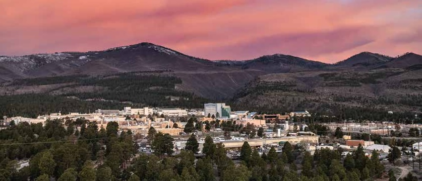

---
hide:
  - navigation
  - toc
title: Los Alamos Computational Condensed Matter Summer School 2025
#template: home.html
---

# Los Alamos Computational Condensed Matter Summer School 2025 - Closing the Loop Between Experiment and Theory

  

**Los Alamos National Laboratory (LANL) will host the 2025 Los Alamos Computational Condensed Matter Summer School in Los Alamos, New Mexico in SUMMER 2025.**

<!--The 2025 Los Alamos Computational Condensed Matter Summer School will expose students to modern and emerging theoretical, computational, and experimental techniques, and gain hands-on training in applying these approaches to current problems in the physical sciences and engineering.-->

## Overview
An increasing number of modern applications of physics, chemistry, materials science, and engineering rely on materials that exhibit manifestations of quantum physics. These quantum materials hold the key not only to new advanced technologies but also to raise fundamental questions about the microscopic physical world. To understand such systems, it has become increasingly necessary to employ a combination of high-resolution spectroscopies and theoretical modeling of the interplay of spin, charge, orbital, and lattice degrees of freedom in parallel to disentangle the rich tapestry of complex properties. This summer school aims to expose students to modern and emerging theoretical and experimental techniques, as well as their application to problems in the physical sciences and engineering. Lectures will be pedagogical, covering (i) the background quantum mechanical and many-body theory necessary to understand modern computational methods (e.g. second quantization, Green’s functions, and functional integrals), (ii) introduce emerging material informatics and ML/Ai tools, and (iii) in-depth tutorial on key experimental techniques (e.g. ARPES, STM, RIXS, Neutron Scattering, Optical Spectroscopy), along with their theoretical underpinnings. Topics will be presented in a logical sequence to ensure all students are on the same footing. Extensive hands-on training using open-source codes will be an integral part of the school. Additionally, the students will visit three user facilities to show how the techniques learned in the classroom translate to real scientific problems. This school is open to both theoretical and experimental students who have completed at least one year of graduate work and is familiar with advanced quantum mechanics and statistical mechanics. Each student will have the opportunity to present their work to encourage in-depth discussion. Questions are encouraged, free time, and hands-on sessions give ample time for students to interact with Faculty and with each other. This school will help train the next generation of researchers to use and develop these tools and methods in their own research programs.

## Important Dates:
* Application open: October 15, 2024
* Application deadline: January 1, 2025
* Results announced: January 15, 2025
* Registration: January 31, 2025
* LANL onboarding package deadline: March 1, 2025
* Poster title/Travel itinerary: End of April, 2025
* Arrival and check in: June 8.2025
* School commence: June 9, 2025

## Topics Covered
* Foundations of Density Functional Theory and Electronic Structure
* The Effect of Electronic Correlations and Many-Body Theory
* Numerical Approach to the Many-Body Problem: DMRG, QMC, DMFT, Gutzwiller
* Background of Modern Experimental Spectroscopies, e.g. ARPES, STM, RIXS, Neutron Scattering, Optical Spectroscopy
* Material Informatics and ML/AI for Quantum Materials

## How to Apply: www.placeholderweb.com/apply

## Organizers
* Christopher Lane (T-4/LANL)
* Roxanne Tutchton (T-4/LANL)
* Elizabeth Peterson (T-4/LANL)
* Johanna Palmstrom (MPA-MAGLAB/LANL)
* Yue Huang (MPA-CINT/LANL)
* Ying Wai Li (CCS-7/LANL)

## Sponsors
* Institute of Materials Science (IMS), LANL
* Institutional Computing, LANL
* Center for Nonlinear Studies, LANL
* Information Science and Technology Institute (ISTI), LANL
* ICAM
